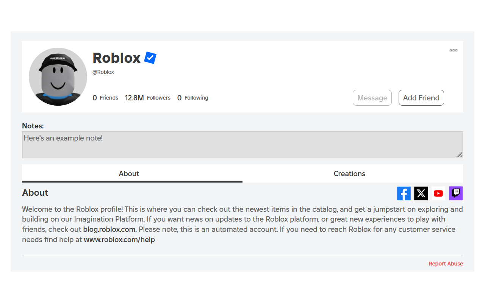
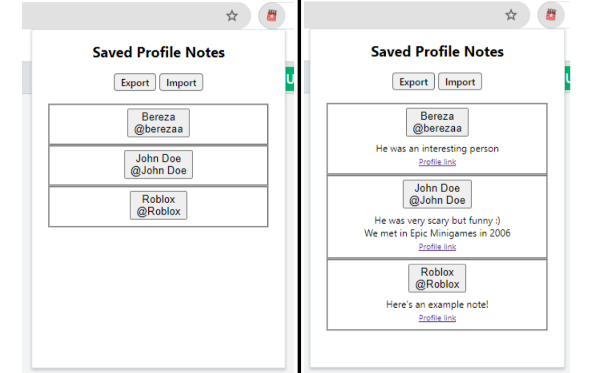

# Roblox Profile Notes  

Add and save custom notes to individual Roblox profiles!  
Click on the extension icon to view and import/export all of your notes.

</img>
</img>

## Chrome Extension
https://chromewebstore.google.com/detail/oppdpokdhgchlccgkdflnfckdebccgke

## Firefox Add-On (no longer updated as of v1.1.1; reason below)
https://addons.mozilla.org/en-US/firefox/addon/roblox-profile-notes

## Have a feature request or feedback?
Please submit an issue [here](https://github.com/charleskimbac/roblox-profile-notes/issues). If something's not working, please include what other Roblox browser extensions you have on.

## Install extension manually
- [Download the latest release zip file for your browser](https://github.com/charleskimbac/roblox-profile-notes/releases).
- Extract and open the folder.
  - If you're on Firefox, all of the needed files are in the `firefox` folder; you can delete anything outside of it.
  - If you're on Chrome or a Chromium-based browser, you can delete the `firefox` folder.
- Move the folder to a safe place where it won't get deleted accidentally (e.g. your `Documents` folder).
- Go to your browser extension manager or enter `chrome://extensions/` (or equivalent) into your address bar.
- Enable `Developer Mode`.
- Click `Load Unpacked`.
- Select the extracted folder.
  - Ensure that this folder has a `manifest.json` file directly inside of it.
  - If you're on Firefox, this should be the `firefox` folder (assuming you didn't move any files).

## Why Firefox will probably no longer be updated
This is assuming that I add new features, which I probably won't since the extension does its job and I can't think of much to add. If you have any ideas, please bring them up and create an [issue](https://github.com/charleskimbac/roblox-profile-notes/issues).  
In an attempt to get the `Featured` badge (lol) for the extension on the Chrome Web Store, I needed to make sure Firefox workarounds (read below) were removed and the code was "clean" for Chromium.    
The way Firefox handles MV3 extension permissions is a pain (as of the time of writing). Roblox Profile Notes (RPN) requires specific permissions to work, and these permissions aren't asked for on extension download, unlike on Chrome/Chromium. Instead, users need to go into RPN's extension settings in their Firefox extension manager and explicitly allow the permissions, creating a poor UX and a big possibility of users wondering why nothing is working without permissions. (This is assuming that the extension has Firefox users, which I don't think it does lol.) To go around this problem, RPN on Firefox is based on MV2, which does explicitly asks the user to grant permissions on extension download. However, developing for both MV2 and MV3 is a little bit of a headache, e.g. MV2 doesn't support `Promise` returns for methods and the different namespaces for the Chromium and Firefox APIs (e.g. `chrome.storage` vs `browser.storage`; normally Firefox can convert them, but sometimes not for whatever reason). This would require me to code a bunch of workarounds to make sure the same code works for any browser. It's not too much extra work though, so if I do add more features and the Firefox version becomes outdated, just tell me and I'll probably do it for you :).  
Also, I used to use Firefox and that's a reason I was fine with the discrepancies, but now I'm on Brave (for Chromium uBO support) since I found using Firefox to be a headache (but that's a story for another time).  
Maybe someone will read this one day.
