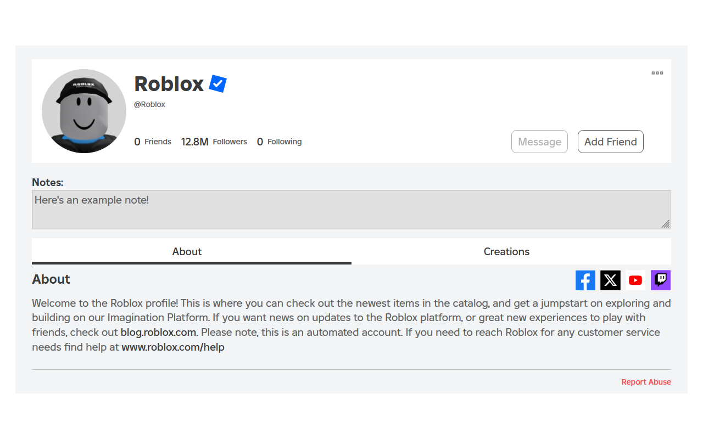
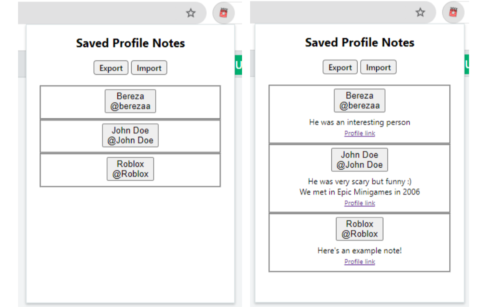

# Roblox Profile Notes  

Add and save custom notes to individual Roblox profiles!  
Click on the extension icon to view and import/export all of your notes.

</img>
</img>

## Chrome Extension
https://chromewebstore.google.com/detail/oppdpokdhgchlccgkdflnfckdebccgke

## Firefox Add-On
https://addons.mozilla.org/en-US/firefox/addon/roblox-profile-notes

## Install extension manually
- [Download the latest release zip file for your browser](https://github.com/charleskimbac/roblox-profile-notes/releases).
  - If you decide to download the source code instead:
    - Extract the folder and and enter the extracted folder.
      - Another folder should be inside. This will be the folder to install later.
    - Find the `[browser].manifest.json` files.
    - *Remove* the `[browser].` in the filename for the browser you are using.
    - Example: if you're on Chrome (Chromium), then rename `chrome.manifest.json` to `manifest.json`.
- Extract the folder.
- Move the folder to a safe place where it won't get deleted accidentally (e.g. `Documents`).
- Go to your browser extension manager or enter `chrome://extensions/` (or equivalent) into your address bar.
- Enable `Developer Mode`.
- Click `Load Unpacked`.
- Select the extracted folder.
  - Ensure that this folder has a `manifest.json` file *directly* inside of it.
  - The folder should not contain another folder.
